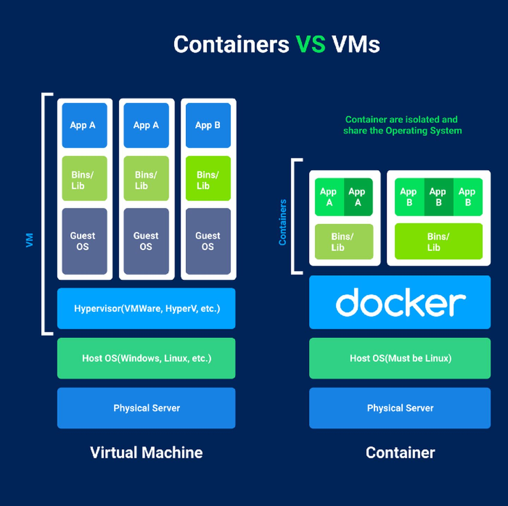
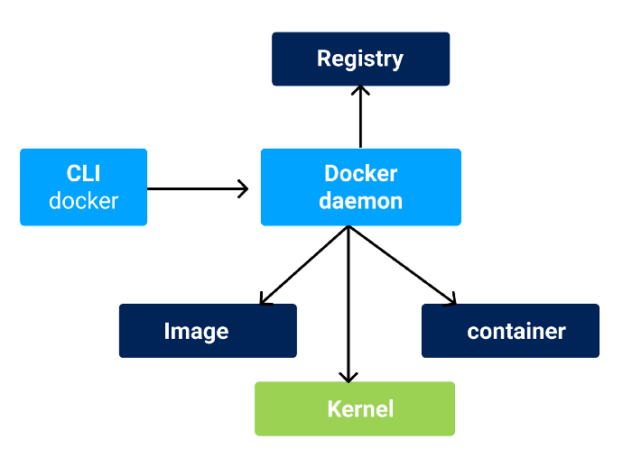

<!--
 * @Author: tangdaoyong
 * @Date: 2021-01-18 13:45:43
 * @LastEditors: tangdaoyong
 * @LastEditTime: 2021-01-18 20:06:41
 * @Description: docker
-->
# docker

[docker官方网站](https://docs.docker.com/)
[docker文档](https://docs.docker.com/docker-for-mac/install/)
[docker安装](http://c.biancheng.net/view/3119.html)
[Docker Vs Podman](https://zhuanlan.zhihu.com/p/321700587?utm_source=com.microsoft.office.outlook)

## 介绍

Docker 是一个容器化平台，在这个平台中，我们可以将我们的应用程序与容器中的库和环境绑定在一起。 Docker Container 在某种程度上类似于虚拟机。

与硬件虚拟化的虚拟机不同，在 Docker 中，运行中的容器共享主机 OS 内核。

Docker 工作流程:

`Docker` 的两个主要组成模块是： `Docker Daemon` 和 `Docker CLI`。

请允许我简短地解释一下：

`Docker Daemon`： 一个常驻的后台进程，帮助管理和创建 Docker 镜像、容器、网络和存储卷。

`Docker Engine REST API`： 一个应用程序用来与 `Docker` 守护进程进行交互的 `API`; 可以通过 `HTTP` 客户端访问它。

`Docker CLI`： 一个用来与 `Docker` 守护进程进行交互的 `Docker` 命令行客户端，也就是 `Docker` 命令。

如果换个角度思考，我们可以把下面这些问题与 Docker 联系起来：

1. 众所周知，Docker 运行在单个进程上，这可能会导致单点故障。
2. 所有子进程都归属于此进程。
3. 无论何时，如果 Docker 守护进程失败，所有子进程都会失去跟踪并进入孤立状态。
4. 安全漏洞。
5. 对于 Docker 的操作，所有步骤都需要由 root 执行。